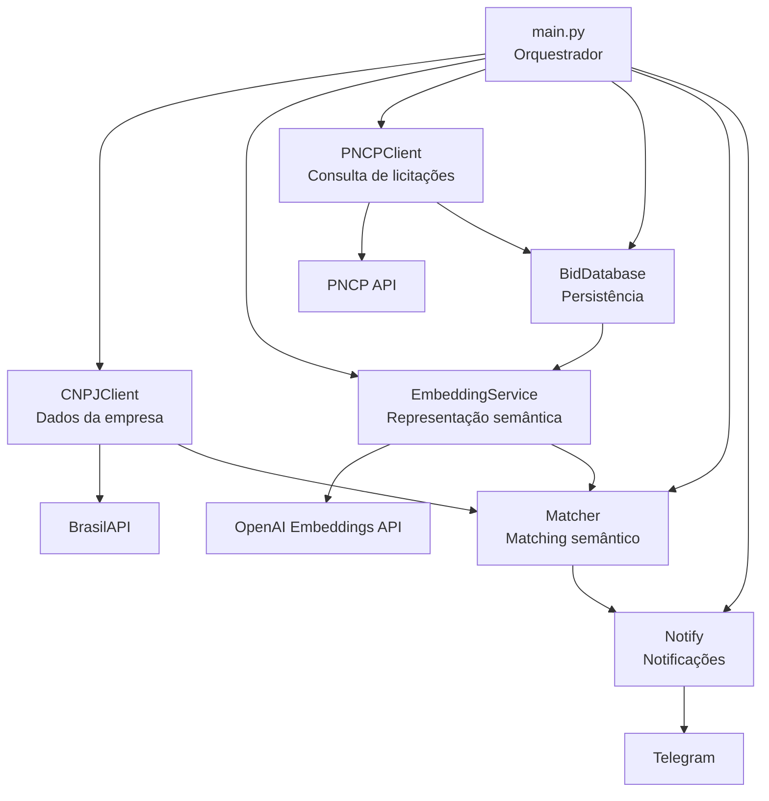
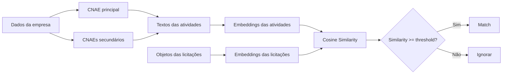
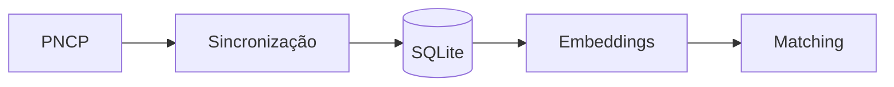

# BidMatch

<p align="center">
  <strong>Matching semântico de licitações baseado nas atividades econômicas de empresas.</strong>
</p>

<p align="center">
  Automatize a identificação de oportunidades de contratação pública utilizando dados do PNCP, embeddings e similaridade semântica.
</p>

<p align="center">


</p>

---

## Sobre o projeto

O **BidMatch** é uma aplicação Python desenvolvida para identificar automaticamente licitações que apresentam potencial compatibilidade com as atividades econômicas de uma empresa.

Em vez de depender exclusivamente de palavras-chave, o sistema utiliza **embeddings semânticos** para representar:

* as atividades econômicas da empresa;
* os objetos das licitações.

Essas representações são comparadas através de **similaridade de cosseno**, permitindo identificar relações semânticas mesmo quando a descrição da atividade e o objeto da contratação utilizam palavras diferentes.

O fluxo principal é:

```text
Empresa
   │
   ├── CNAE principal
   └── CNAEs secundários
          │
          ▼
     Embeddings
          │
          │
          ▼
Licitações do PNCP
          │
          ▼
Objeto da contratação
          │
          ▼
     Embeddings
          │
          ▼
Similaridade semântica
          │
          ▼
    Threshold
          │
          ▼
Licitações compatíveis
          │
          ▼
     Telegram
```

O objetivo é transformar um processo potencialmente manual de monitoramento em um fluxo automatizado de identificação de oportunidades.

---

# Principais características

* 🔎 Consulta de dados de empresas através do CNPJ.
* 🏢 Identificação do CNAE principal e CNAEs secundários.
* 📋 Integração com o Portal Nacional de Contratações Públicas (PNCP).
* 📄 Paginação e normalização das respostas da API.
* 🧠 Geração de embeddings semânticos.
* 🔗 Matching entre atividades econômicas e licitações.
* 📐 Similaridade de cosseno.
* 🎯 Threshold configurável para controle da sensibilidade do matching.
* 💾 Persistência local das licitações.
* 🔔 Notificações através do Telegram.
* 🔄 Tratamento de falhas e retries em integrações HTTP.
* 🧪 Testes automatizados dos principais componentes.
* 📝 Logging estruturado da execução.

---

# Arquitetura

O projeto foi estruturado de forma modular, mantendo as integrações externas e as regras de negócio separadas.



A arquitetura atual privilegia **simplicidade e separação de responsabilidades**, evitando introduzir componentes adicionais enquanto o mecanismo de matching ainda está sendo validado.

---

# Estrutura do projeto

```text
bid_match/
│
├── app/
│   │
│   ├── cnpj/
│   │   ├── __init__.py
│   │   └── client.py
│   │
│   ├── embeddings/
│   │   ├── __init__.py
│   │   ├── client.py
│   │   └── service.py
│   │
│   ├── matching/
│   │   ├── __init__.py
│   │   └── matcher.py
│   │
│   ├── notification/
│   │   ├── __init__.py
│   │   ├── formatter.py
│   │   └── notifier.py
│   │
│   └── pncp/
│       ├── __init__.py
│       ├── client.py
│       └── database.py
│
├── tests/
│   ├── test_cnpj_client.py
│   ├── test_formatter.py
│   ├── test_matcher.py
│   └── test_pncp_client.py
│
├── logging_config.py
├── main.py
├── requirements.txt
└── .gitignore
```

---

# Stack tecnológica

| Tecnologia            | Utilização                               |
| --------------------- | ---------------------------------------- |
| **Python**            | Linguagem principal                      |
| **OpenAI Embeddings** | Representação semântica                  |
| **PNCP API**          | Fonte de dados das contratações públicas |
| **BrasilAPI**         | Consulta de dados cadastrais e CNAEs     |
| **SQLite**            | Persistência local                       |
| **NumPy**             | Operações numéricas e similaridade       |
| **Requests**          | Comunicação HTTP                         |
| **python-dotenv**     | Gerenciamento de variáveis de ambiente   |
| **pytest**            | Testes automatizados                     |
| **Telegram**          | Notificação de oportunidades             |
| **Logging**           | Observabilidade e diagnóstico            |

---

# Pipeline de matching

O matching semântico é o principal componente de inteligência do projeto.

A empresa não é representada apenas pelo seu CNPJ ou por uma única descrição textual. Suas atividades econômicas são utilizadas para criar múltiplas representações semânticas.



---

# 1. Representação da empresa

A empresa possui:

```text
CNAE principal
+
CNAEs secundários
```

Cada atividade é transformada em uma representação textual contextualizada.

Exemplo:

```text
Atividade econômica: comércio varejista especializado de equipamentos de informática
```

Esse texto é enviado para o modelo de embeddings.

O resultado é um vetor numérico que representa semanticamente aquela atividade.

Conceitualmente:

```text
Texto
  │
  ▼
Embedding Model
  │
  ▼
[0.021, -0.114, 0.083, ...]
```

Cada atividade mantém sua própria representação.

Isso é importante porque uma empresa pode atuar em diferentes segmentos.

---

# 2. Representação da licitação

A licitação é representada principalmente através do seu objeto.

Por exemplo:

```text
Aquisição de computadores, notebooks, monitores e periféricos
```

é transformado em um embedding.

Assim, tanto a empresa quanto a licitação passam a existir no mesmo espaço vetorial.

```text
Empresa
   │
   └── Atividade econômica
             │
             ▼
         Embedding
             │
             │
             │ mesmo espaço vetorial
             │
             ▼
         Embedding
             ▲
             │
   ┌─────────┘
   │
Licitação
   │
   └── Objeto
```

---

# 3. Similaridade de cosseno

Depois que os embeddings são gerados, o `Matcher` calcula a similaridade entre os vetores.

A ideia é medir o quanto duas representações apontam para uma direção semelhante no espaço vetorial.

Uma representação simplificada seria:

```text
           Atividade
              ↗
             /
            /
           / θ
          /
         ●──────────────►
              Licitação
```

Quanto menor o ângulo entre os vetores, maior tende a ser a similaridade.

---

# 4. Threshold

O sistema utiliza um threshold para determinar quais correspondências devem ser consideradas relevantes.

Exemplo:

```text
MATCH_THRESHOLD=0.50
```

Considerando:

| Atividade                               | Similaridade | Resultado  |
| --------------------------------------- | -----------: | ---------- |
| Comércio de equipamentos de informática |         0.87 | ✅ Match    |
| Manutenção de computadores              |         0.72 | ✅ Match    |
| Comércio de móveis                      |         0.21 | ❌ Ignorado |

O threshold é configurável porque a escolha do valor adequado depende do comportamento observado nos dados reais.

---

# 5. Múltiplos matches

O sistema não precisa limitar uma licitação a uma única atividade econômica.

Uma empresa pode apresentar:

```text
CNAE principal
CNAE secundário 1
CNAE secundário 2
CNAE secundário 3
...
```

Uma determinada licitação pode apresentar compatibilidade com mais de uma delas.

Exemplo:

```text
Licitação:
"Aquisição de computadores e equipamentos de informática"

        │
        ├── Comércio de computadores ........ 0.89
        ├── Manutenção de equipamentos ...... 0.74
        └── Comércio de móveis .............. 0.19
```

Isso permite que o resultado contenha não apenas o fato de que houve um match, mas também **quais atividades econômicas contribuíram para essa correspondência**.

---

# Integração com o PNCP

O projeto utiliza a API de consulta do Portal Nacional de Contratações Públicas.

A integração é responsável por:

* realizar requisições;
* aplicar filtros;
* percorrer páginas;
* tratar respostas HTTP;
* realizar retries;
* normalizar os dados;
* disponibilizar as licitações para processamento.

O cliente utiliza uma estratégia de retry para lidar com falhas temporárias, incluindo respostas como:

```text
408
429
500
502
504
```

Isso é particularmente importante porque APIs públicas podem apresentar indisponibilidade temporária, rate limiting ou respostas lentas.

---

# Persistência

As licitações processadas são armazenadas localmente.

A persistência permite:



O banco também permite identificar quais licitações já possuem embedding e evitar a necessidade de regenerar representações semânticas desnecessariamente.

---

# Notificações

Quando uma ou mais licitações atingem o threshold definido, os resultados podem ser enviados através do Telegram.

A responsabilidade é separada em duas partes:

```text
formatter.py
      │
      └── Formatação da mensagem

notifier.py
      │
      └── Envio da mensagem
```

Isso permite que a lógica de apresentação seja alterada sem modificar diretamente a integração com o Telegram.

---

# Configuração

As configurações sensíveis devem ser fornecidas através de variáveis de ambiente.

Crie um arquivo:

```text
.env
```

Exemplo:

```env
OPENAI_API_KEY=sua_chave

CNPJ=seu_cnpj

MATCH_THRESHOLD=0.50

TELEGRAM_BOT_TOKEN=seu_token
TELEGRAM_CHAT_ID=seu_chat_id
```

> **Nunca versione o arquivo `.env`.**

O arquivo `.gitignore` deve impedir que credenciais sejam adicionadas ao repositório.

---

# Instalação

## Pré-requisitos

* Python 3.10+
* pip
* conexão com a internet
* chave da API da OpenAI
* configuração do Telegram para notificações

---

## Clone o projeto

```bash
git clone https://github.com/c-machad0/bid_match.git
cd bid_match
```

Para utilizar a branch de desenvolvimento:

```bash
git checkout dev
```

---

## Ambiente virtual

### Windows

```bash
python -m venv .venv
.venv\Scripts\activate
```

### Linux/macOS

```bash
python3 -m venv .venv
source .venv/bin/activate
```

---

## Instalação das dependências

```bash
pip install -r requirements.txt
```

---

## Executando

Após configurar as variáveis de ambiente:

```bash
python main.py
```

O fluxo principal executa:

```text
1. Carregamento da configuração
        ↓
2. Consulta dos dados da empresa
        ↓
3. Geração dos embeddings da empresa
        ↓
4. Sincronização das licitações
        ↓
5. Geração dos embeddings das novas licitações
        ↓
6. Persistência dos embeddings
        ↓
7. Matching semântico
        ↓
8. Notificação dos matches
```

---

# Testes

Os testes estão localizados no diretório:

```text
tests/
```

Execute:

```bash
pytest
```

Ou, para visualizar mais detalhes:

```bash
pytest -v
```

Atualmente existem testes relacionados a:

* cliente de CNPJ;
* cliente PNCP;
* matching;
* formatação das notificações.

---

# Observabilidade

O projeto possui uma configuração centralizada de logging através de:

```text
logging_config.py
```

Durante a execução, informações como:

* início da execução;
* duração;
* quantidade de licitações;
* quantidade de embeddings;
* quantidade de matches;
* erros inesperados;

podem ser registradas.

Exemplo conceitual:

```text
INFO  Iniciando execução
INFO  Sincronização concluída
INFO  Embeddings gerados
INFO  Matching concluído
INFO  Execução concluída | duração=...
```

Isso facilita o diagnóstico quando o processo estiver sendo executado automaticamente em um servidor.

---

# Roadmap

O projeto está em desenvolvimento. O roadmap abaixo representa as principais evoluções planejadas.

## 🟢 Concluído

* [x] Integração com consulta de CNPJ
* [x] Obtenção de CNAE principal
* [x] Obtenção de CNAEs secundários
* [x] Integração com PNCP
* [x] Paginação da API
* [x] Tratamento de retries HTTP
* [x] Persistência de licitações
* [x] Geração de embeddings
* [x] Matching por similaridade de cosseno
* [x] Threshold configurável
* [x] Identificação de múltiplas atividades compatíveis
* [x] Notificação via Telegram
* [x] Logging centralizado
* [x] Testes automatizados iniciais

## 🟡 Em evolução

* [ ] Melhorar a representação semântica das empresas
* [ ] Melhorar a representação semântica das licitações
* [ ] Otimizar geração e armazenamento de embeddings
* [ ] Calibrar o threshold utilizando dados reais
* [ ] Melhorar a estratégia de sincronização com o PNCP
* [ ] Implementar controle de idempotência
* [ ] Controlar notificações já enviadas
* [ ] Ampliar cobertura de testes
* [ ] Melhorar tratamento de falhas do PNCP
* [ ] Melhorar métricas e observabilidade

## 🔵 Planejado

* [ ] Suporte estruturado para múltiplas empresas
* [ ] Execução automatizada através de cronjob
* [ ] Deploy em VPS
* [ ] Histórico de matches
* [ ] Métricas de qualidade do matching
* [ ] Avaliação de falsos positivos e falsos negativos
* [ ] Ranking das oportunidades por relevância
* [ ] Melhor contextualização dos objetos das licitações
* [ ] Otimização de custos da API de embeddings
* [ ] Evolução do sistema de notificações

---

# Princípios do projeto

O desenvolvimento do BidMatch segue alguns princípios:

### Simplicidade antes de complexidade

A arquitetura deve permanecer simples enquanto a solução estiver sendo validada.

Novos componentes devem ser introduzidos somente quando houver uma necessidade concreta.

### Separação de responsabilidades

Integrações externas, persistência, embeddings, matching e notificações possuem módulos próprios.

### Semântica em vez de apenas palavras-chave

O objetivo principal do sistema é identificar relações entre conceitos, não apenas palavras iguais.

### Evolução incremental

A arquitetura atual deve permitir melhorias graduais sem exigir uma reescrita completa da aplicação.

---

# Limitações atuais

O BidMatch ainda está em fase de desenvolvimento.

Algumas limitações conhecidas incluem:

* o matching ainda precisa ser calibrado com uma quantidade maior de dados reais;
* o threshold não deve ser considerado um valor universal;
* a disponibilidade e estabilidade do PNCP podem afetar a coleta;
* a estratégia de sincronização ainda pode ser aprimorada;
* a aplicação atualmente está orientada ao processamento de uma empresa por execução;
* a estratégia de armazenamento dos embeddings pode ser otimizada conforme o volume de dados crescer.

Essas limitações fazem parte do processo de evolução do projeto e estão contempladas no roadmap.

---

# Segurança

Nunca adicione credenciais diretamente ao código.

Não versione:

```text
.env
```

ou arquivos contendo:

```text
OPENAI_API_KEY
TELEGRAM_BOT_TOKEN
TELEGRAM_CHAT_ID
```

Caso uma credencial seja exposta, ela deve ser revogada e substituída.

---

# Contribuição

Contribuições e sugestões são bem-vindas.

Para alterações maiores, recomenda-se criar uma branch específica:

```bash
git checkout -b feature/nova-funcionalidade
```

Executar os testes:

```bash
pytest
```

E realizar o commit após validar as alterações:

```bash
git add .
git commit -m "feat: descrição da alteração"
git push origin feature/nova-funcionalidade
```

---

# Licença

Este projeto ainda não possui uma licença de código aberto definida.

---

# Autor

**Christian Machado**

Projeto desenvolvido em Python com foco em:

* automação;
* dados públicos;
* inteligência semântica;
* integração com APIs;
* identificação automatizada de oportunidades em contratações públicas.

---

<p align="center">
  <strong>BidMatch</strong><br>
  Levando as oportunidades até você.
</p>
